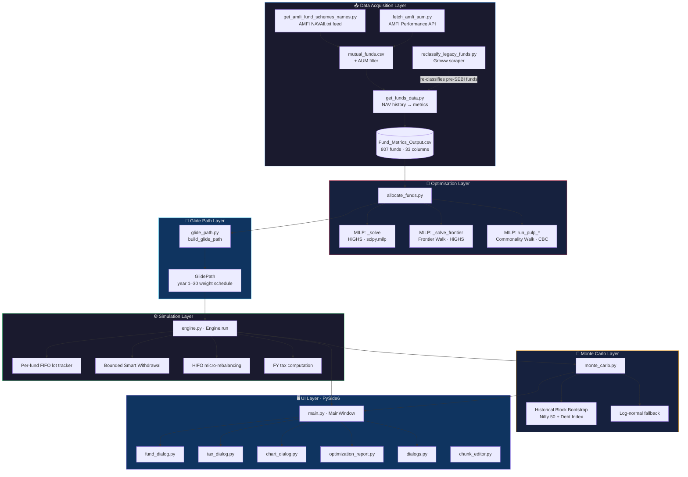
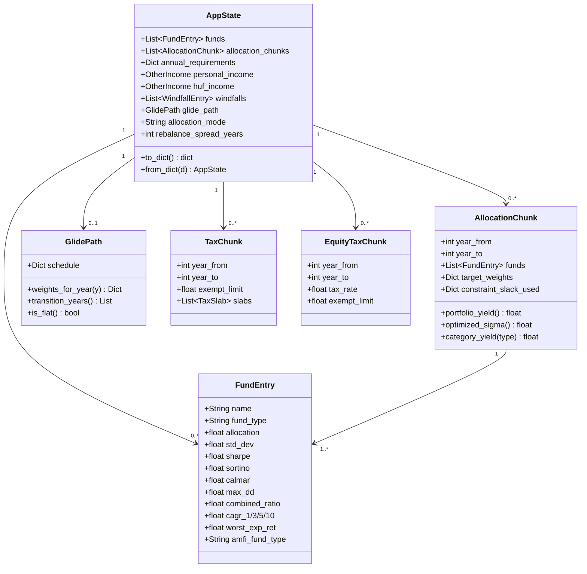
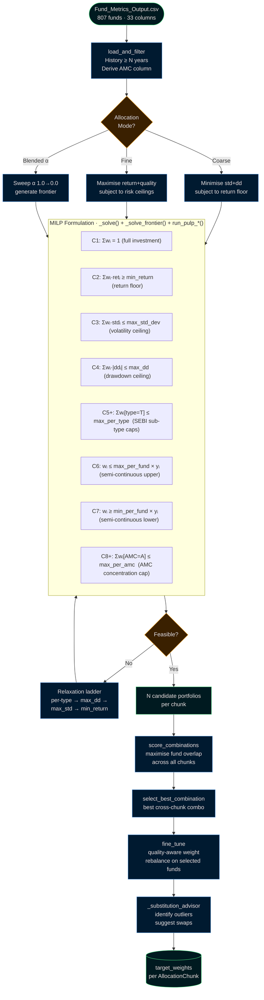
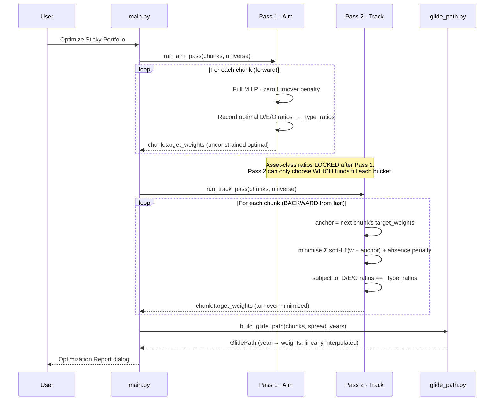
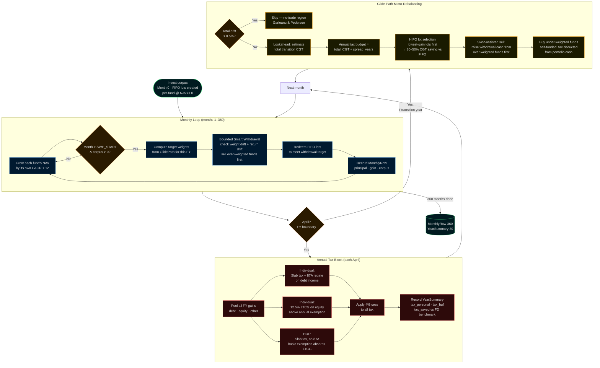
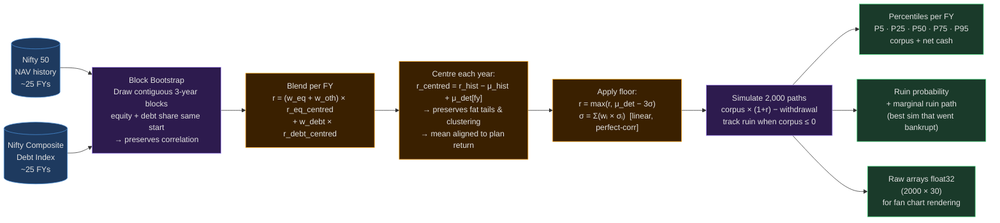
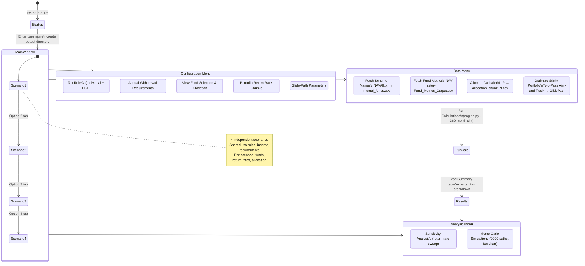

# 📊 SWP Financial Planner

> A desktop application for Indian retirees planning a **Systematic Withdrawal Plan (SWP)** from a portfolio of mutual funds — optimising fund selection, computing taxes across Individual and HUF entities, and stress-testing corpus survival with Monte Carlo simulation over a 30-year horizon.

---

## ✨ What it does

The core thesis: a well-structured portfolio of **debt + arbitrage mutual funds** split across an **Individual + HUF** entity pair can significantly outperform fixed deposits on an after-tax basis over 30 years.

| Capability | Detail |
|---|---|
| 📥 **Data Acquisition** | Downloads live AMFI NAV data, computes Sharpe / Sortino / Calmar / Alpha / Max DD across 3Y / 5Y / 10Y windows |
| 🧮 **Portfolio Optimisation** | Mixed-Integer Linear Program (HiGHS + PuLP/CBC) with constraints on return, volatility, drawdown, per-fund, per-type, and per-AMC concentration |
| 📅 **Multi-Chunk Planning** | Separate optimal portfolios for different life phases (e.g. years 1–10, 11–20, 21–30) with minimised turnover between phases |
| 🔀 **Glide Path** | Linear weight interpolation across chunk boundaries — monthly withdrawals do the rebalancing, avoiding large CGT events |
| 💰 **Full Tax Engine** | Month-by-month simulation: progressive slabs, LTCG, STCG, 87A marginal relief, cess, exit loads — Individual and HUF in parallel |
| 🎲 **Monte Carlo** | Historical Block Bootstrap using real Nifty 50 + Nifty Composite Debt index data; log-normal fallback |
| 📋 **4-Scenario Comparison** | Run up to 4 independent allocation strategies side-by-side |

---

## 🗺️ System Architecture



---

## 🔄 End-to-End Data Flow

```mermaid
flowchart LR
    classDef file    fill:#1e3a5f,stroke:#4a90d9,color:#e0e0e0,rx:6
    classDef process fill:#2d1b4e,stroke:#a78bfa,color:#e0e0e0,rx:6
    classDef output  fill:#1a3a2a,stroke:#4ade80,color:#e0e0e0,rx:6
    classDef user    fill:#3a1a1a,stroke:#f87171,color:#e0e0e0,rx:6

    U1([👤 User\nmarks funds of interest]):::user
    P1[get_amfi_fund_schemes_names]:::process
    P2[fetch_amfi_aum]:::process
    F1[(mutual_funds.csv)]:::file
    F2[(amfi_aum.csv)]:::file
    F3[(Fund_Details.csv\nwith Allocation_L)]:::file
    P3[get_funds_data.py\nNAV download + metrics]:::process
    F4[(Fund_Metrics_Output.csv)]:::file
    P4[allocate_funds.py\nMILP optimisation]:::process
    F5[(allocation_chunk_N.csv\nper-chunk weights)]:::file
    P5[glide_path.py\nbuild schedule]:::process
    F6[(GlidePath\nyear → weights)]:::file
    P6[engine.py\n360-month simulation]:::process
    O1[(MonthlyRow × 360\nYearSummary × 30)]:::output
    P7[monte_carlo.py\nblock bootstrap]:::process
    O2[(MCResults\nfan charts + ruin %)]:::output

    P1 --> F1
    P2 --> F2
    F1 & F2 --> U1 --> F3
    F3 --> P3 --> F4
    F4 --> P4 --> F5
    F5 --> P5 --> F6
    F6 --> P6 --> O1
    O1 --> P7 --> O2
```



---

## 📐 Data Model



---

## 🧮 Optimisation Pipeline



---

## 🔀 Two-Pass Aim-and-Track

*Used by **Optimize Sticky Portfolio** to minimise fund turnover between time chunks.*



---

## ⚙️ Engine Simulation Loop



---

## 🎲 Monte Carlo Simulation



---

## 🖥️ Application UI Flow



---

## 📁 Module Map

```
RetirementTaxPlanning/
│
├── run.py                      ← Launch: user name dialog → MainWindow
├── main.py                     ← MainWindow · 4-scenario tabs · all menus
│
├── ── Data Pipeline ──
├── get_amfi_fund_schemes_names.py   AMFI NAVAll.txt → fund list CSV
├── fetch_amfi_aum.py                AMFI Performance API → AUM CSV
├── get_funds_data.py                NAV history → Fund_Metrics_Output.csv
├── reclassify_legacy_funds.py       Groww scraper → reclassify old fund types
│
├── ── Optimisation ──
├── allocate_funds.py                MILP portfolio optimiser (HiGHS + PuLP)
├── glide_path.py                    Chunk weights → year-by-year GlidePath
│
├── ── Simulation ──
├── engine.py                        360-month SWP simulator + tax engine
├── monte_carlo.py                   Historical block bootstrap MC
│
├── ── Data Model ──
├── models.py                        Dataclasses: AppState, FundEntry, chunks...
├── configuration.py                 Singleton config reader
│
├── ── UI Dialogs ──
├── fund_dialog.py                   Fund selection & allocation viewer/editor
├── tax_dialog.py                    Tax rules editor (slabs, LTCG rates)
├── chart_dialog.py                  Matplotlib chart pop-ups (non-modal)
├── optimization_report.py           Post-optimisation 4-tab report
├── dialogs.py                       Income, requirements, HUF, FD rate, MC
├── chunk_editor.py                  Reusable year-range chunk table widget
│
├── RetirementTaxPlanning.configuration    All tunable constants
└── .gitignore
```

---

## 🔑 Key Algorithms

### MILP Portfolio Optimisation

The optimizer uses **Mixed-Integer Linear Programming** (semi-continuous variables) to handle the "if selected, allocate at least X%" constraint natively — no iterative pruning needed.

```
Objective (Fine mode):
  maximise  Σ wᵢ × (adj_retᵢ + λ × quality_normᵢ)
  where  quality_norm = Combined_Ratio / max(Combined_Ratio)
         λ = 10% of return spread  →  quality as tiebreaker, not driver

Constraints:
  C1:  Σwᵢ = 1                       full investment
  C2:  Σwᵢ·retᵢ ≥ min_return        return floor
  C3:  Σwᵢ·stdᵢ ≤ max_std_dev       volatility ceiling (lin weighted)
  C4:  Σwᵢ·|ddᵢ| ≤ max_dd          drawdown ceiling
  C5+: Σwᵢ[type=T] ≤ max_per_type   per-SEBI-subcategory cap
  C6:  wᵢ ≤ max_per_fund × yᵢ       semi-continuous upper link
  C7:  wᵢ ≥ min_per_fund × yᵢ       semi-continuous lower link
  C8+: Σwᵢ[AMC=A] ≤ max_per_amc    per-AMC concentration cap
```

AMC is derived from the first word of the fund name (e.g. `"ICICI Prudential Short Term Fund"` → AMC `"Icici"`).

### Sigma Convention

All portfolio volatility is the **linear allocation-weighted average**:

```
σ_portfolio = Σ(wᵢ × σᵢ)     ← perfect correlation, upper bound
```

This is the same value shown in the "View Fund Selection" dialog (`Std:X.XX%`) and used by Monte Carlo. It is the most conservative valid estimate — the correct ordering is:

```
σ_rms = sqrt(Σ wᵢ² × σᵢ²)  ≤  σ_lin = Σwᵢσᵢ  ≤  sqrt(Σwᵢσᵢ²)
 zero correlation                 ↑ used           Jensen's ineq — not valid
  (lower bound)               upper bound           (overestimates)
```

### HIFO Tax-Alpha

During rebalancing, lots are sorted by **ascending unrealised gain** (Highest cost-basis In, First Out). Selling the cheapest-to-realise lots reduces CGT by 30–50% vs FIFO. Normal monthly SWP withdrawals use FIFO (SEBI retail requirement).

### Backward Induction Eliminates Conservative Drag

A naïve penalised optimiser suffers the *Binary Cliff*: too-high turnover penalty → solver holds safe assets early to avoid future sells. Two-Pass fixes this by locking D/E/O ratios in Pass 1. Pass 2 can only choose *which funds* fill each bucket — it cannot reduce equity allocation to avoid a future sell.

---

## ⚙️ Configuration

All tunable constants in `RetirementTaxPlanning.configuration`:

| Key | Default | Meaning |
|---|---|---|
| `cess_rate` | `0.04` | 4% health & education cess on all tax |
| `stcg_holding_months` | `12` | Months before LTCG treatment applies |
| `exit_load_fraction` | `0.01` | 1% exit load within STCG period |
| `drift_cap_personal` | `0.0015` | 0.15% return drift cap (personal portfolio) |
| `drift_cap_huf` | `0.0050` | 0.50% return drift cap (HUF portfolio) |
| `weight_drift_threshold` | `0.015` | 1.5% per-fund weight deviation trigger |
| `rebalance_no_trade_band` | `0.005` | 0.5% total portfolio drift no-trade zone |
| `amfi_sleep_between_calls` | `0.4` | Seconds between AMFI API calls |
| `allocator_default_input` | `Fund_Metrics_Output.csv` | Default input for the allocator |
| `default_cagr_fallback` | `7.0` | Fallback CAGR (%) when no data available |

---

## 🚀 Installation

```bash
# Clone
git clone https://github.com/<your-username>/RetirementTaxPlanning.git
cd RetirementTaxPlanning

# Virtual environment
python3 -m venv .venv
source .venv/bin/activate        # Linux / macOS
# .venv\Scripts\activate         # Windows

# Dependencies
pip install -r requirements.txt
```

**Core dependencies:** `PySide6` · `pandas` · `numpy` · `scipy` · `matplotlib` · `requests` · `pulp` · `tqdm`

> **Linux:** `sudo apt-get install libxcb-cursor0 libxcb-xinerama0` if you see Qt platform errors.

---

## 📖 Usage

### Step 1 — Launch

```bash
python run.py
```
Enter your name. All outputs are written to `<project_root>/<your_name>/`.

### Step 2 — Build the fund universe

```
Data → Fetch Scheme Names      downloads NAVAll.txt → mutual_funds.csv
Data → Fetch Fund Metrics      NAV history → Fund_Metrics_Output.csv  (~10–30 min)
```

### Step 3 — Allocate capital

```
Data → Allocate Capital

  Mode:  Coarse (minimise risk)  or  Fine (maximise return)

  Per time-chunk parameters:
    Min Ret%    minimum expected return  (e.g. 7.25%)
    Max/Fund%   max weight per fund      (e.g. 8%)
    Min/Fund%   min weight if selected   (e.g. 2%)
    Max/Type%   max per SEBI sub-type    (e.g. 24%)
    Max/AMC%    max per AMC house        (e.g. 16%)
    Min Hist Y  minimum fund age         (e.g. 12 years)

  ▶ Run Allocation  →  ⟳ Apply Substitutions
```

### Step 4 — Review and edit

```
Configuration → View Fund Selection & Allocation
  Header: live Yield · Std (lin) · |DD| · D%/E%/O%
  Edit allocation column directly; header updates instantly.
```

### Step 5 — Optimise the glide path *(optional)*

```
Data → Optimize Sticky Portfolio
  Two-Pass Aim-and-Track minimises turnover across chunks.
  Opens 4-tab Optimization Report.
```

### Step 6 — Run the simulation

```
[Run Calculations button]        360-month simulation → annual table + charts

Analysis → Run Monte Carlo       2,000 bootstrap paths → fan chart + ruin %
```

---

## 📤 File Outputs

All written to `<project_root>/<user_name>/`:

| File | Source | Contents |
|---|---|---|
| `Fund_Metrics_Output.csv` | `get_funds_data.py` | 33-column risk metrics for all analysed funds |
| `allocation_chunk_N_yrX-Y.csv` | `allocate_funds.py` | Fund weights + metrics for chunk N |
| `allocation_summary.csv` | `allocate_funds.py` | All chunks combined with portfolio totals |
| `portfolio_viz.html` | `allocate_funds.py` | Standalone interactive risk-return visualisation |
| `allocation_params.json` | `main.py` | Persisted allocation dialog settings |
| `*.swp_project` | `main.py` | Full project save (AppState as JSON) |
| `mc_nifty50_nav.csv` | `monte_carlo.py` | Cached Nifty 50 NAV history (weekly refresh) |
| `mc_debt_index.csv` | `monte_carlo.py` | Cached Nifty Composite Debt Index |
| `Schemes_and_Funds/mutual_funds.csv` | `get_amfi_fund_schemes_names.py` | Full AMFI fund universe |
| `Schemes_and_Funds/amfi_aum.csv` | `fetch_amfi_aum.py` | Daily AUM per fund |

---

## 📜 Licence

Private repository — all rights reserved.